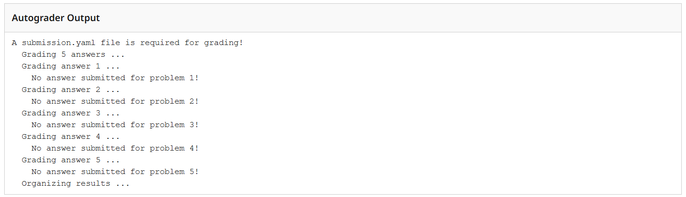
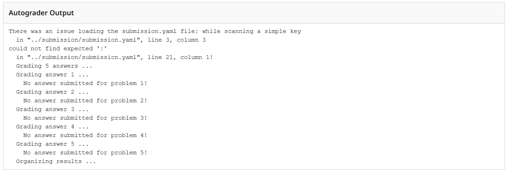
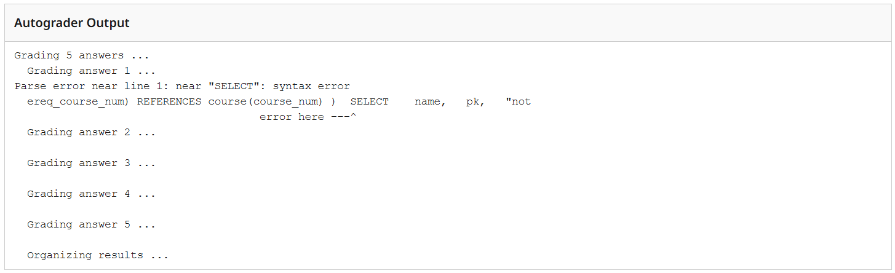
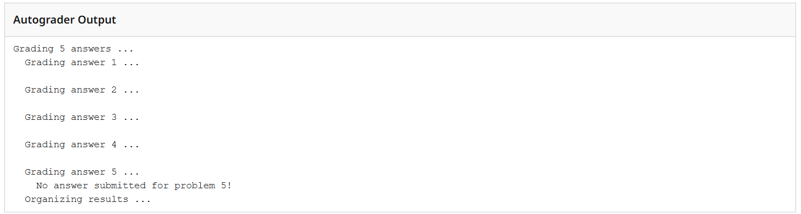
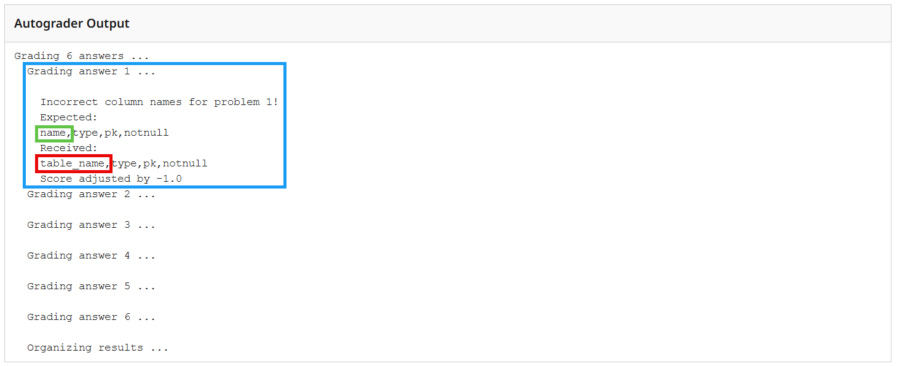

<h1 style="text-align: left; margin: 0;"></h1>

## Assignment Overview

| **Assignment**           | **Code**         | **Document**        | **Question Based**  | **Peer Collaboration**   | **Group Submission**    |   **AI Assistance**  | 
|:------------------------:|:----------------:|:-------------------:|:-------------------:|:------------------------:|:-----------------------:|:---------------------|
| HW1_Create_ERD           | ❌               | ✅                 | ❌                  | ✅ (Required 3 to 5)    | ✅                      | ✅                  |
| HW2_Create_ERD_Database  | ✅               | ✅                 | ❌                  | 💡 (Optional Up to 5)   | ✅                      | ✅                  |
| HW3_CRUD_Operations      | ✅               | ❌                 | ❌                  | ❌                      | ❌                      | ✅                  |
| HW4_Intermediate_SQL     | ✅               | ❌                 | ❌                  | ❌                      | ❌                      | ✅                  |
| HW4_Advanced_SQL         | ✅               | ❌                 | ❌                  | ❌                      | ❌                      | ✅                  |
| CP0_Autograder_Warmup    | ✅               | ❌                 | ❌                  | 💡 (Optional Up to 5)   | ❌                      | ✅                  |
| CP1_Create_Database      | ✅               | ❌                 | ❌                  | 💡 (Optional Up to 5)   | ❌                      | ✅                  |
| CP2_CRUD_Operations      | ✅               | ❌                 | ❌                  | 💡 (Optional Up to 5)   | ❌                      | ✅                  |
| CP3_Intermediate_SQL_1   | ✅               | ❌                 | ❌                  | 💡 (Optional Up to 5)   | ❌                      | ✅                  |
| CP4_Intermediate_SQL_2   | ✅               | ❌                 | ❌                  | 💡 (Optional Up to 5)   | ❌                      | ✅                  |
| CP5_Transform_Load_Data  | ✅               | ❌                 | ❌                  | 💡 (Optional Up to 5)   | ❌                      | ✅                  |
| Quiz_1                   | ❌               | ❌                 | ✅                  | ❌                      | ❌                      | ❌                  |
| Quiz_2                   | ❌               | ❌                 | ✅                  | ❌                      | ❌                      | ❌                  |
| Quiz_3                   | ❌               | ❌                 | ✅                  | ❌                      | ❌                      | ❌                  |
| Quiz_4                   | ❌               | ❌                 | ✅                  | ❌                      | ❌                      | ❌                  |
| Quiz_5                   | ❌               | ❌                 | ✅                  | ❌                      | ❌                      | ❌                  |
| Final_Exam_P1            | ❌               | ❌                 | ✅                  | ❌                      | ❌                      | ❌                  | 
| Final_Exam_P2            | ✅               | ❌                 | ❌                  | ❌                      | ❌                      | ❌                  | 
| GP1_Create_ERD_Database  | ✅               | ✅                 | ❌                  | ✅ (Required 3 to 5)    | ✅                      | ✅                  |
| GP2_Transform_Load_Data  | ✅               | ❌                 | ❌                  | ✅ (Required 3 to 5)    | ✅                      | ✅                  |
| GP3_Hackathon            | ✅               | ❌                 | ❌                  | ✅ (Required 3 to 5)    | ✅                      | ✅                  |

- **Code**: `.yaml` file templates are used for each assignment that requires a code submission. This formatting allows for autograder functionality without the need to submit separate query files for every question in the assignment. 
- **Document**: `pdf` files are used for free-form responses/images based on assignment instructions. 
- **Question Based**: Quizzes/Exams will have True/False, multiple choice, and matching questions completed on Canvas.
- **Collaboration** indicates the maximum number of students allowed when collaboration is permitted for the assignment.
- **Group Submision** indicates whether the assignment is a group submission on Canvas/Gradescope.
- **AI Assistance** indicates whether the use of AI tools such as ChatGPT is permitted is permitted for the assignment.

!!! note
    Please pay close attention to the assignments that have the 💡 optional peer collaboration but ❌ for group submission. This means you can collaborate with your peers on assignment completion but you **MUST** submit the assignment individually to receive credit.

## Autograder Formatting

Autograder functionality on Gradescope is utilized for HW2 - HW5, all CP activities and GP assignments, and Final_Exam_P2. This enables immediate grading of your code based assignments.

**Steps for Submission**:

1. **Download the Assignment Files**: All homework and group project assignment files will be provided on Canvas. 
2. **Input Your Answers**: Populate the `submission.yaml` file with your responses for each respective question. Be sure to follow assignment instructions as there may be some required code provided in the starter `submission.yaml` file. 
3. **Formatting Reference**: See the example `submission.yaml` file below to understand the required format. Critical components include the use of the "pipe" character for multiline strings and proper indentation. Incorrect formatting can result in the autograder misreading your submission.

```yaml
- question: 1
  answer: |
    SELECT * FROM student;

- question: 2
  answer: |
    INSERT INTO student (student_id, last_name, first_name, email_address) VALUES 
    (100001, 'Doe', 'Jane','jane.doe@domain.edu');
```
**Additional Formatting Notes**:

- The `submission.yaml` file will be provided complete with all of the required questions for the assignment. 
- Do **NOT** modify the "question" sections in the `submission.yaml` file.
- Do **NOT** change the name of the `submission.yaml` file provided for the assignment.
- Your code **MUST** be indented and should **NOT** be left aligned with `answer: |`
- To ensure accurate formatting, edit/paste your code into a text editor that supports `.yaml` files.

!!! note
    The `submission.yaml` file provided for the assignment will be the same file name for all **Code** assignments. Recommend you create a folder structure on your computer for each assignment to keep the assignment files organized.

**Submitting Your Work**:

- Before submission, validate your `submission.yaml` file with a [yaml checker](https://yamlchecker.com/) or utilize a plain text editor that highlights syntax errors with **red squiggly lines**.
- Upload/Drag your completed `submission.yaml` file to Gradescope for the respective assignment.
- You can re-submit your assignment multiple times before the late **submission due date**.

!!! tip "ChatGPT Suggested Prompt"
    I need help formatting a `.yaml` file for my assignment. Below is the file I currently have (it may not be in `.yaml` format yet). Please reformat it correctly into valid `.yaml` and explain any important changes you made so I can learn from it.

### Autograder Feedback

In most situations, the Autograder will attempt to evaluate all questions and provide a response so you get the Autograder Output instead of just a Gradescope error. This means you will get a score for your submission but you can re-submit your assignment multiple times before the late **submission due date**. 

The Autograder is designed to **ONLY** provide high level feedback in response to several known submission problems. Below are examples for each with Autograder Output screenshots.    

#### No `submission.yaml` file



#### Invalid `.yaml` Syntax



#### Invalid `SQL` Syntax



!!! note
    The Autograder output indicates some SQL parse error near `SELECT` in Question 1. This is an example with a missing `;` in between two SQL statements for the same question.

#### Missing Question/Answer



#### Incorrect Column Names

If the only difference in your solution is incorrect column names, the Autograder will alert you to the expected column names and only subtract 1.0 from your score. This is designed to prevent you from spending a lot of time debugging your code solely for mismatching column names.



!!! warning
    The Autograder is not designed to provide any other feedback beyond the above examples. Be sure to run and compare your output to the sample output in the assignment instructions. Some questions may **NOT** have sample output as it could provide too much leading information about the correct solution.
