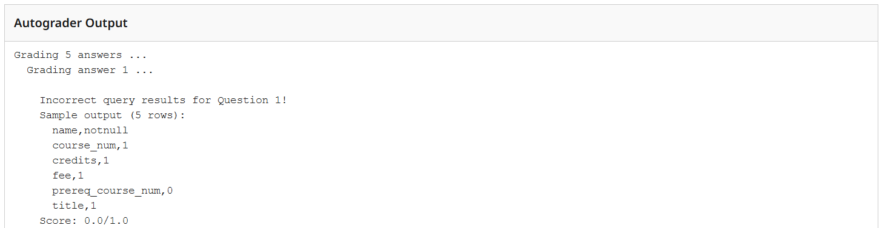
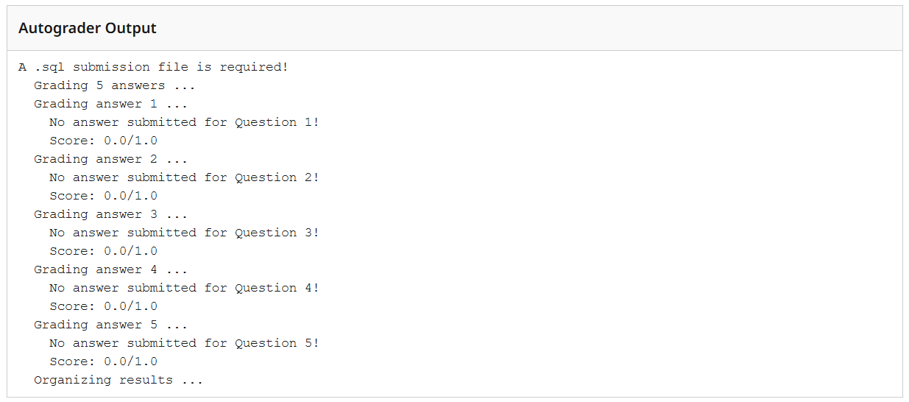
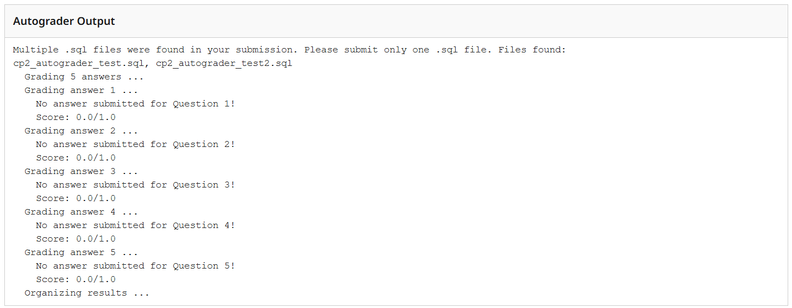
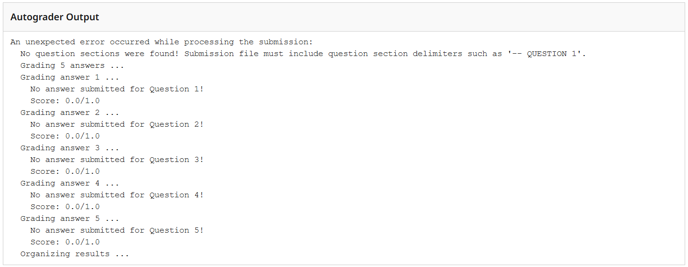
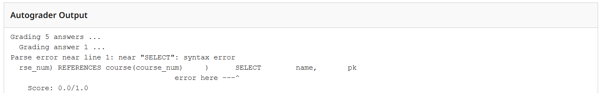
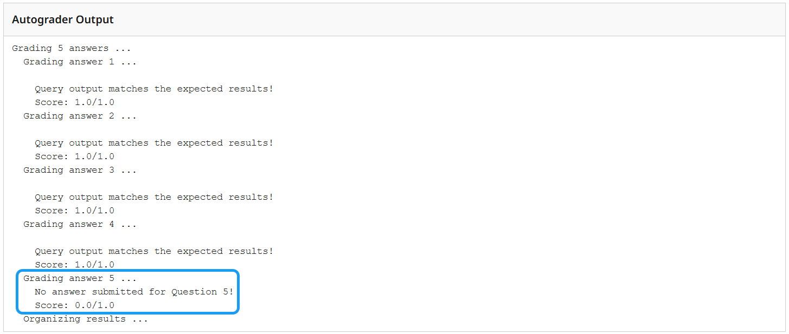
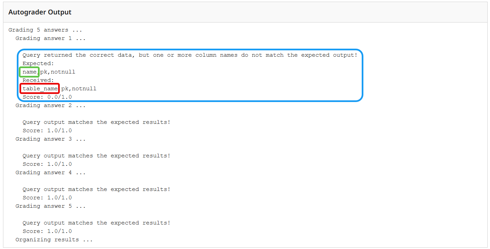
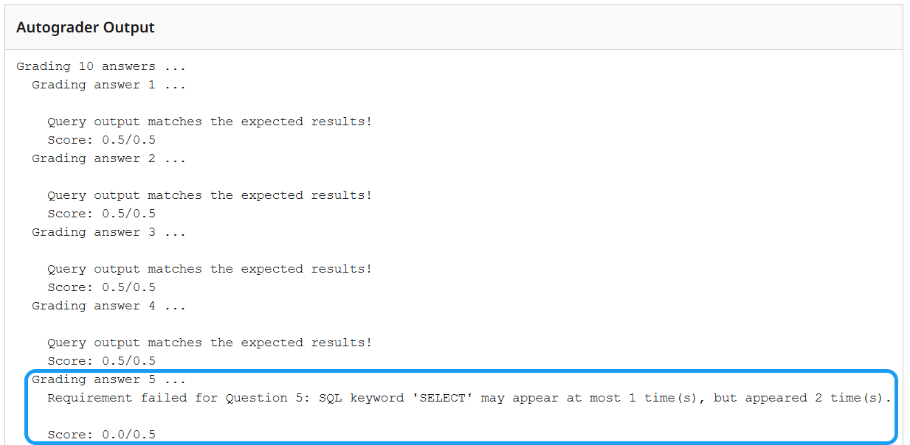

<h1 style="text-align: left; margin: 0;"></h1>

## Assignment Overview

| **Assignment**               | **Code**         | **Document**        | **Question Based**  | **Peer Collaboration**   | **Group Submission**    |   **AI Assistance**  | 
|:----------------------------:|:----------------:|:-------------------:|:-------------------:|:------------------------:|:-----------------------:|:---------------------|
| HW1_Create_ERD               | ❌               | ✅                 | ❌                  | ✅ (Required 3 to 5)    | ✅                      | ✅                  |
| HW2_ERD_Submission           | ❌               | ✅                 | ❌                  | 💡 (Optional Up to 5)   | ❌                      | ✅                  |
| HW2_Create_Database          | ✅               | ❌                 | ❌                  | 💡 (Optional Up to 5)   | ❌                      | ✅                  |
| HW3_CRUD_Operations          | ✅               | ❌                 | ❌                  | ❌                      | ❌                      | ✅                  |
| HW4_Intermediate_SQL         | ✅               | ❌                 | ❌                  | ❌                      | ❌                      | ✅                  |
| HW5_Advanced_SQL             | ✅               | ❌                 | ❌                  | ❌                      | ❌                      | ✅                  |
| CP1_Group_Formation          | ❌               | ✅                 | ❌                  | ✅ (Required 3 to 5)    | ❌                      | ✅                  |
| CP2_Implement_Conceptual_ERD | ✅               | ❌                 | ❌                  | 💡 (Optional Up to 5)   | ❌                      | ✅                  |
| CP3_Create_Database          | ✅               | ❌                 | ❌                  | 💡 (Optional Up to 5)   | ❌                      | ✅                  |
| CP4_CRUD_Operations          | ✅               | ❌                 | ❌                  | 💡 (Optional Up to 5)   | ❌                      | ✅                  |
| CP5_Intermediate_SQL_1       | ✅               | ❌                 | ❌                  | 💡 (Optional Up to 5)   | ❌                      | ✅                  |
| CP6_Intermediate_SQL_2       | ✅               | ❌                 | ❌                  | 💡 (Optional Up to 5)   | ❌                      | ✅                  |
| CP7_Transform_Load_Data      | ✅               | ❌                 | ❌                  | 💡 (Optional Up to 5)   | ❌                      | ✅                  |
| CP8_Advanced_SQL             | ✅               | ❌                 | ❌                  | 💡 (Optional Up to 5)   | ❌                      | ✅                  |
| Exam_1                       | ❌               | ✅                 | ✅                  | ❌                      | ❌                      | ❌                  | 
| Exam_2_P1                    | ✅               | ❌                 | ❌                  | ❌                      | ❌                      | ✅                  | 
| Exam_2_P2                    | ❌               | ❌                 | ✅                  | ❌                      | ❌                      | ❌                  |
| GP1_ERD_Submission           | ❌               | ✅                 | ❌                  | ✅ (Required 3 to 5)    | ✅                      | ✅                  |
| GP1_Create_Database          | ✅               | ❌                 | ❌                  | ✅ (Required 3 to 5)    | ✅                      | ✅                  |
| GP2_Transform_Load_Data      | ✅               | ❌                 | ❌                  | ✅ (Required 3 to 5)    | ✅                      | ✅                  |
| GP3_Data_Exploration         | ✅               | ❌                 | ❌                  | ✅ (Required 3 to 5)    | ✅                      | ✅                  |
| GP4_Hackathon                | ✅               | ❌                 | ❌                  | ✅ (Required 3 to 5)    | ✅                      | ✅                  |
| GP5_Storytelling             | ❌               | ✅                 | ❌                  | ✅ (Required 3 to 5)    | ✅                      | ✅                  |

- **Code**: `.sql` file templates are used for each assignment that requires a code submission. This formatting allows for autograder functionality without the need to submit separate query files for every question in the assignment. 
- **Document**: `.pdf` files are used for free response submissions based on assignment instructions. 
- **Question Based**: Exams will have True/False, multiple choice, matching questions, and/or free-response questions completed In-Class or online on Canvas.
- **Collaboration** indicates the maximum number of students allowed when collaboration is permitted for the assignment.
- **Group Submission** indicates whether the assignment is a group submission on Canvas/Gradescope.
- **AI Assistance** indicates whether the use of AI tools such as Claude/ChatGPT is permitted for the assignment.

!!! note
    Please pay close attention to the assignments that have the 💡 optional peer collaboration but ❌ for group submission. This means you can collaborate with your peers on assignment completion but you **MUST** submit the assignment individually to receive credit.

## Autograder Formatting

All assignments designated with a ✅ in the Code column above utilize autograder functionality on Gradescope. This enables immediate grading of your code based assignments.

**Steps for Submission**:

1. **Download the Assignment Resource Files**: All assignment files will be provided on Canvas. 
2. **Input Your Answers**: Populate the `_submission.sql` file with your responses for each respective question. Be sure to follow assignment instructions as there may be some required code provided in the template file. 
3. **Formatting Reference**: See the example `_submission.sql` file below to understand the required format. Incorrect formatting can result in the autograder misreading your submission.

```sql
-- QUESTION 1
SELECT 
  student_id,
  first_name,
  last_name,
  email_address
FROM student
ORDER BY
  student_id;

-- QUESTION 2
INSERT INTO student (student_id, last_name, first_name, email_address) VALUES 
(100001, 'Doe', 'Jane','jane.doe@domain.edu');

SELECT 
  student_id,
  first_name,
  last_name
FROM student
WHERE student_id = 100001;
```

**Additional Formatting Notes**:

- A starter `_submission.sql` file is provided complete with all of the required questions for the assignment. You are welcome to rename the `_submission.sql` file for each assignment but your **one** submission file must remain a `.sql` file extension. 
- It is highly recommended to **NOT** modify the "question" sections in the `_submission.sql` file. However, the parser is intentionally flexible and will detect different variations of the "question" sections including:  
  `-- Question 1`  
  `-- question: 1`  
  `-- Q1`  
  `-- q: 1`  
  `-- PROBLEM 1`  
  `-- problem: 1`  

**Submitting Your Work**:

- Upload/Drag your completed `.sql` submission file to Gradescope for the respective assignment.
- You can re-submit your assignment multiple times before the late **submission due date**.

### Autograder Feedback

In most situations, the Autograder will attempt to evaluate all questions and provide a response so you get the Autograder Output instead of just a Gradescope error. Gradescope requires a result for every question in order to display feedback in the Autograder Output. This means you will get a score for your submission but you can re-submit your assignment multiple times before the late **submission due date**. 

The Autograder is designed to **ONLY** provide high level feedback in response to several known submission problems. Below are examples for each with Autograder Output screenshots.    

#### Incorrect Query Results



!!! note
    The **Autograder Output** will not provide specific feedback about *why* your query returned incorrect results. However, one of the most common submission issues is uploading the wrong file. To help you troubleshoot, the autograder includes a **sample output (5 rows) for your query**, which *may* provide clues about what went wrong.

#### No `.sql` file



#### Multiple `.sql` files



!!! note
    🎉 Good news! You no longer have to play the **"Did I name my file correctly?"** game. Your `.sql` submission file can have any filename you choose. To keep the Autograder happy, just make sure your submission contains **exactly one** `.sql` file.

#### No `-- Question #` Sections



#### Invalid `SQL` Syntax



!!! note
    The Autograder output indicates some SQL parse error near `SELECT` in Question 1. This is an example with a missing `;` in between two SQL statements for the same question.

#### Missing Question/Answer



#### Incorrect Column Names

If the only difference in your solution is incorrect column names, the Autograder will alert you to the expected column names and only subtract 1.0 from your score. This is designed to prevent you from spending a lot of time debugging your code solely for mismatching column names.



!!! warning
    The Autograder is not designed to provide any other feedback beyond the above examples. Be sure to run and compare your output to the sample output in the assignment instructions. Some questions may **NOT** have sample output as it could provide too much leading information about the correct solution.

#### Keyword Requirements

Some questions have SQL keyword requirements to ensure assignments are completed using specific methods relevant to the current course material. The example below is feedback that multiple SELECT statements such as usage in a CTE or Subquery is not permitted.



!!! tip
    Pay close attention to this feedback, as it may provide hints about how to approach the question and identify which SQL concepts you are expected to use.