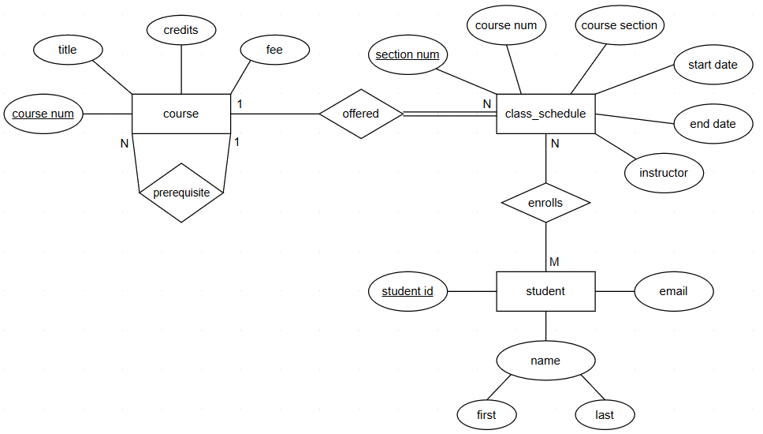

# Implement Conceptual ERD

## Overview

In this demo, we will get some hands-on practice with the concepts we have learned so far in the Relational Databases lecture and also learn about SQLite, the [most used](https://www.sqlite.org/mostdeployed.html) database engine in the world. SQLite is a lightweight relational database engine that is often used for small and/or embedded databases because it doesn't require a separate server process and is easy to integrate into applications. The entire database including all of the tables, indices, and the data itself is stored in the database file on your computer. SQLite is highly portable and many desktop applications and mobile apps use it to store their data.

??? question "Important SQLite Considerations"
    When working with SQLite, be aware of the following important differences from larger relational database systems:

    1. **Type Affinity (Not Strict Typing)**  
    SQLite uses *type affinity*, which means columns have a recommended type but do not strictly enforce it. For example, inserting a string into a column declared as `INT` will not cause an error. This can lead to inconsistent data if not carefully managed.

    2. **Foreign Keys Are Not Enforced by Default**  
    Unlike other databases, SQLite does **NOT** enforce foreign key constraints unless explicitly enabled. To ensure referential integrity, you must run:  
    ```sql
    PRAGMA foreign_keys = ON;
    ```

### SQL Autograder Warmup

This demo will also be used as warmup exercise to get comfortable with the autograder format requirements that will be utilized for all SQL programming assignments for this course. `CP0_Autograder_Warmup` is worth 5 **bonus points** that will count towards the 100 participation points for the class. All queries required for ``CP0_Autograder_Warmup` will be provided in this resource since the primary objective is to gain familiarity with the `.yaml` file formatting for Gradescope submissions. These queries also provide the foundation necessary to complete `CP1_Create_Database` and `HW2_Create_Database` since the SQL concepts utilized have not been covered in class yet.

!!! note
    Participation points are intended to encourage hands-on learning by actively engaging with the demonstrations during class. This allows you to follow along and reinforce key concepts in real-time.

### SQLite Type Affinities

Below is a table of the five type affinities in SQLite and how it applies to some of the data types used in other relational database systems such as MySQL. For this demo, we will explicitly utilize data types that directly align with the type affinity. Read more about data types in SQLite [here](https://www.sqlite.org/datatype3.html).

| Affinity  | Description                                                                   | Applies When Declared Type Contains                     |
|-----------|-------------------------------------------------------------------------------|----------------------------------------------------------|
| `TEXT`  | Stores values as text (UTF-8, UTF-16LE, or UTF-16BE).                         | `CHAR`, `CLOB`, `TEXT`                                   |
| `NUMERIC` | Stores values as integers or floats when possible; also used for date/time. | `NUMERIC`, `DECIMAL`, `BOOLEAN` or unrecognized types    |
| `INTEGER` | Stores values as integers.                                                  | `INT`                                                    |
| `REAL`  | Stores values as 8-byte floating-point numbers.                               | `REAL`, `FLOAT`, `DOUBLE`                                |
| `BLOB`  | No type conversion; values stored exactly as input.                           | Type is exactly `BLOB` or completely unrecognized        |

!!! note
    Data types are not evaluated in the grader for `CP0_Autograder_Warmup` but will be a requirement in `CP1_Create_Database` and `HW2_Create_Database`.

### Some Thoughts on Naming Conventions
If you do any amount of research on the web about best practices for table and column naming conventions, the main thing that you will discover is there does not seem to be any consistent recommendations. Should you use a `snake_case`, `camelCase`, or `PascalCase` naming convention? Should you use singular or plural nouns? The latter seems to be a pretty highly debated topic. Check out this [Stack Overflow post](https://stackoverflow.com/questions/338156/table-naming-dilemma-singular-vs-plural-names) where it seems almost every other answer/comment contradicts each other. 

**Here are two general rules to consider:**

1. Be consistent
2. Avoid names that conflict with applicable DBMS [reserved words](https://en.wikipedia.org/wiki/List_of_SQL_reserved_words)

In line with rule #1 above, we will use `snake_case` throughout this course and favor singular nouns unless it just sounds weird when you say it out loud or it violates rule #2. Click [here](https://www.baeldung.com/sql/database-table-column-naming-conventions) to read a little more about naming conventions.

### Install DB Browser

To follow along, you will need to install [DB Browser](https://sqlitebrowser.org/), an app used for working with SQLite database files. Click [here](https://sqlitebrowser.org/dl/) to go to the DB Browser downloads page and follow the instructions to download and install the version for your operating system.

## Create Database

In this demo, we will be creating a SQLite version of the small university database that has been referenced in the Introduction and Relational Databases lectures. Open **DB Browser** and click on the button "New Database".


Select a folder location on your computer and name the new database `university` and click Save.

## Implementing Entities and Attributes

We will be converting the following conceptual ERD into a logical design for SQLite.



First, we will write the initial `CREATE TABLE` statements for the `course`, `class_schedule`, and `student` tables.

!!! warning "Important Implementation Requirements"
    
    * Table names are **NOT** considered in the autograder but typically should be implemented in **lower case** with `_` in between words matching the ERD entity box **exactly**.
    * Attribute names **MUST** be converted to all **lower case** with `_` in between words.
    * Attributes must accurately represent whether a column allows NULL values, based on business requirements and/or ERD specifications.
    * Composite attribute requirements will be specified but typically are some combination of the child and parent names or vice versa with `_` in between words.

For this simple database, there are no weak entities since each entity can be uniquely identified by its own key attributes. Therefore, the tables are pretty straight forward with only simple attributes and one key attribute for each table.

The `course` table has 4 attributes with `course_num` as the primary key.

``` sql
CREATE TABLE course (
  course_num integer NOT NULL,
  title text NOT NULL,
  credits integer NOT NULL,
  fee numeric NOT NULL,
  CONSTRAINT course_pk PRIMARY KEY(course_num)
);
```
!!! warning
    SQLite can cache updates in memory and some tools stage edits until you commit or write changes. 
  
In DB Browser, you use the Write Changes button to commit any pending updates to the database.


In addition, it will prompt you if you attempt to close the app or database with changes that have not been made to the database yet.


The `class_schedule` table has 6 attributes with `section_num` as the primary key.

``` sql
CREATE TABLE class_schedule (
  section_num integer NOT NULL, 
  course_num integer NOT NULL, 
  course_section text NOT NULL, 
  start_date text NOT NULL, 
  end_date text NOT NULL, 
  instructor text NOT NULL, 
  CONSTRAINT class_schedule_pk PRIMARY KEY(section_num)
);
```
The `student` table has 4 attributes with `student_id` as the primary key.

``` sql
CREATE TABLE student (
  student_id integer NOT NULL, 
  first_name text NOT NULL, 
  last_name text NOT NULL, 
  email text NOT NULL, 
  CONSTRAINT student_pk PRIMARY KEY(student_id)
);
```

## Implementing Relationships

### 1:N or N:1 Relationships

The relationship between `course` and `class_schedule` is 1:N because the same course can be offered on the class schedule multiple times. However, for each class section, it can only be offered for one course. We will add a foreign key constraint on the many side of the relationship in the `CREATE TABLE class_schedule` statement.

``` sql
CREATE TABLE class_schedule (
  section_num integer NOT NULL, 
  course_num integer NOT NULL, 
  course_section text NOT NULL, 
  start_date text NOT NULL, 
  end_date text NOT NULL, 
  instructor text NOT NULL, 
  CONSTRAINT class_schedule_pk PRIMARY KEY(section_num),
  CONSTRAINT class_schedule_course_fk FOREIGN KEY (course_num) REFERENCES course(course_num)
);
```
You may come across the SQL syntax where foreign keys are added after all tables have been created using the `ALTER TABLE` and `ADD CONSTRAINT` statements. One advantage of this approach is that it eliminates the need to create the tables in a specific order (i.e., cannot add a foreign key restraint that references a table that does not exist yet). For example, here is an example for altering the `class_schedule` table and adding the same foreign key constraint.

``` sql
ALTER TABLE class_schedule ADD CONSTRAINT class_schedule_course_fk FOREIGN KEY(course_num)
REFERENCES course (course_num);
```

!!! tip
    SQLite does not support adding foreign key constraints with `ALTER TABLE` after the table has already been created as you can in other databases like MySQL or PostgreSQL.

#### Recursive Relationships

In addition, the recursive relationship between `course` is 1:N because a course can only have 1 prerequisite course but that course can be a prerequisite for multiple courses. As noted by the partial participation line on the 1 side of the relationship, all courses do not have a prerequisite so this indicates this column must allow `NULL` values. The total participation line on the N side confirms the course must exist in order to be a prerequisite.

Let's go back and add the additional `prereq_course_num` column and the self-referencing foreign key.

``` sql
CREATE TABLE course (
  course_num integer NOT NULL,
  title text NOT NULL,
  credits integer NOT NULL,
  fee numeric NOT NULL,
  prereq_course_num integer NULL,
  CONSTRAINT course_pk PRIMARY KEY(course_num),
  CONSTRAINT prereq_course_fk FOREIGN KEY (prereq_course_num) REFERENCES course(course_num)
);
```

!!! note
    In real-world situations, the recursive relationship between course most likely would be M:N since a course could have multiple prerequisites but was limited to 1 to illustrate the concepts on how this type of relationship would be implemented in the same table.

### M:N Relationships

We have one M:N relationship since each class section can have many students enrolled and each student can enroll in multiple classes. We will need a new bridge table that contains two foreign keys, referring to the primary keys of the related tables. For the university ERD, we do not have any attributes connected to the `enrolls` relationship so the new bridge table will only have columns for the respective primary keys of the related tables.

There is no standard convention for bridge table names but `class_schedule_student` just doesn't sound natural so we will go with the name `enrollment` here since the purpose of the table is to track all students enrollment in classes.

``` sql
CREATE TABLE enrollment (
  student_id integer NOT NULL, 
  section_num integer NOT NULL, 
  CONSTRAINT enrollment_pk PRIMARY KEY (student_id, section_num), 
  CONSTRAINT enrollment_student_fk FOREIGN KEY (student_id) REFERENCES student(student_id), 
  CONSTRAINT enrollment_course_fk FOREIGN KEY (section_num) REFERENCES class_schedule(section_num)
);
```

## Submission Formatting

We are now ready to take each of our SQL statements and paste into the `submission.yaml` for grading. For SQL query assignments, this will be pretty straight forward where you will simply paste your query in the `submission.yaml` file for the respective question. However, database creation assignments require some special queries but these will be provided and you will focus on writing the SQL to create all relevant tables for the database with appropriate data types, foreign keys, primary keys, and other constraints.

#### Strong Entity Tables

First, let's discuss the required SQL that is utilized by the autograder for validating the structure of tables implemented for strong entities. SQLite has a `pragma_table_info('table_name')` function that returns a result set (similar to a table), which contains information about the columns of a specified table. This result set includes one row for each column in the table and contains the following columns:

1. `cid`: The column ID (an integer index, starting from 0).
2. `name`: The name of the column.
3. `type`: The data type of the column.
4. `notnull`: An integer indicating whether the column has a NOT NULL constraint (1 for true, 0 for false).
5. `dflt_value`: The default value for the column, or NULL if no default value is specified.
6. `pk`: An integer indicating whether the column is part of the primary key (1 for true, 0 for false).

For this warmup exercise, we will only be using 3 out of 6 columns in the result to validate column names, binary indicator for the primary key(s), and binary indicator if the column allows NULL values. 

!!! tip
    This is why column names, correct primary keys and the NULL/NOT NULL constraint are important!

**Example usage:**

``` sql
SELECT 
  name,
  pk,
  "notnull"
FROM pragma_table_info('course')
ORDER BY
  name;
```

!!! note
    You may wonder why `notnull` is enclosed in double quotes (""). In SQL, `NOTNULL` is a reserved keyword, and without the quotes, the query will result in an error. You can safely enclose every column in double quotes if you would like.

Here is the full code for question 1 to create the `course` table.

``` yaml
- question: 1
  answer: |
    CREATE TABLE course (
      course_num integer NOT NULL,
      title text NOT NULL,
      credits integer NOT NULL,
      fee numeric NOT NULL,
      prereq_course_num integer NULL,
      CONSTRAINT course_pk PRIMARY KEY(course_num),
      CONSTRAINT prereq_course_fk FOREIGN KEY (prereq_course_num) REFERENCES course(course_num)
    );

    SELECT 
      name,
      pk,
      "notnull"
    FROM pragma_table_info('course')
    ORDER BY
      name;
```

!!! warning "Important SQL Formatting Requirement"
    
    * Each query MUST have a `;` in between each statement for each question in your `submission.yaml` file. Pay close attention to the `ORDER BY` requirements since the row order must match exactly!

Let's now add in the queries for the `class_schedule` and `student` tables. You will notice the formatting is similar with the `CREATE TABLE` statement followed by the `pragma_table_info()` query.

``` yaml
- question: 2
  answer: |
    CREATE TABLE class_schedule (
    section_num integer NOT NULL, 
    course_num integer NOT NULL, 
    course_section text NOT NULL, 
    start_date text NOT NULL, 
    end_date text NOT NULL, 
    instructor text NOT NULL, 
    CONSTRAINT class_schedule_pk PRIMARY KEY(section_num), 
    CONSTRAINT class_schedule_course_fk FOREIGN KEY (course_num) REFERENCES course(course_num)
    );

    SELECT 
      name,
      pk,
      "notnull"
    FROM pragma_table_info('class_schedule')
    ORDER BY
      name;  

- question: 3
  answer: |
    CREATE TABLE student (
      student_id integer NOT NULL, 
      first_name text NOT NULL, 
      last_name text NOT NULL, 
      email text NOT NULL, 
      CONSTRAINT student_pk PRIMARY KEY(student_id)
    );

    SELECT 
      name,
      pk,
      "notnull"
    FROM pragma_table_info('student')
    ORDER BY
      name;
```

#### Weak Entity/Bridge Tables

The implementation of weak entities and/or bridge tables to decompose M:N relationships require critical thinking and the structure of the `submission.yaml` file could provide many clues on the correct logical design. Therefore, all other tables in the database will be graded in a single question with the output based on a custom database view in the Autograder.

For the `university` database, we only have the one bridge table for the `student` to `class_schedule` M:N relationship so we will add that `CREATE TABLE` statement above the query that will validate all tables.

``` yaml
- question: 4
  answer: |
    CREATE TABLE enrollment (
      student_id integer NOT NULL, 
      section_num integer NOT NULL, 
      CONSTRAINT enrollment_pk PRIMARY KEY (student_id, section_num), 
      CONSTRAINT enrollment_student_fk FOREIGN KEY (student_id) REFERENCES student(student_id), 
      CONSTRAINT enrollment_course_fk FOREIGN KEY (section_num) REFERENCES class_schedule(section_num)
    );

    SELECT
      column_name,
      is_pk,
      pk_has_fk,
      table_cnt,
      fk_reference_cnt
    FROM vw_composite_table_summary
    ORDER BY
      column_name
```

#### Foreign Keys

All foreign keys will be automatically evaluated and you only need to ensure that all tables in the prior questions have the proper foreign key design.

``` yaml
- question: 5
  answer: |
    SELECT
      fk_column,
      ref_column,
      table_cnt,
      ref_table_cnt
    FROM vw_foreign_key_summary
    ORDER BY
      fk_column,
      ref_column;
```

!!! warning "Important Formatting Requirements"
    
    * The `SELECT` statement that uses the `vw_composite_column_summary` and `vw_foreign_key_column_summary` will be provided in all starter `submission.yaml` files and should `NOT` be changed.

## Autograder Submission

We are now ready to submit our `submission.yaml` file on Gradescope for grading of `CP0_Autograder_Warmup`.

## Conclusion

In this demo, we analyzed the university entity-relationship diagram (ERD) and followed all implementation steps to convert our conceptual data model to a logical database design.
