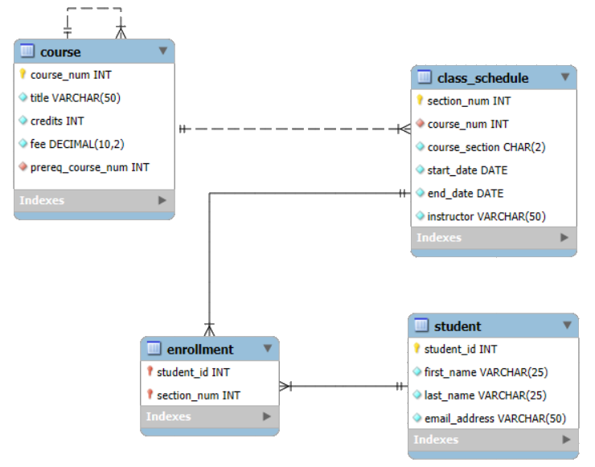
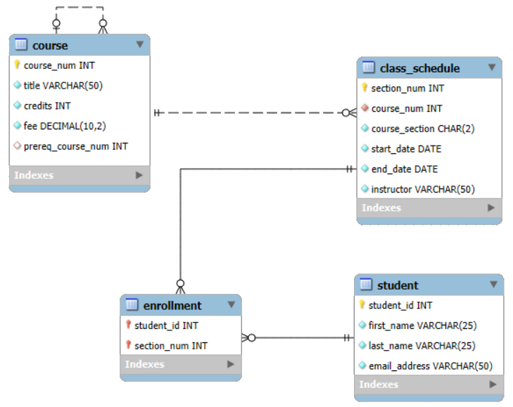
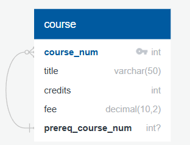
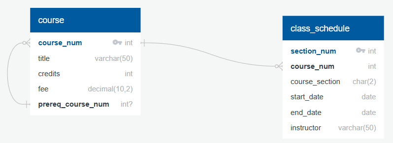
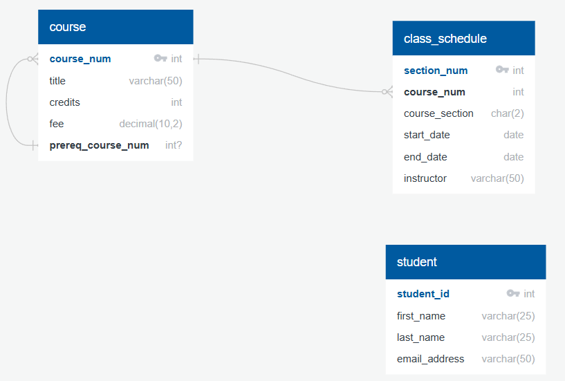
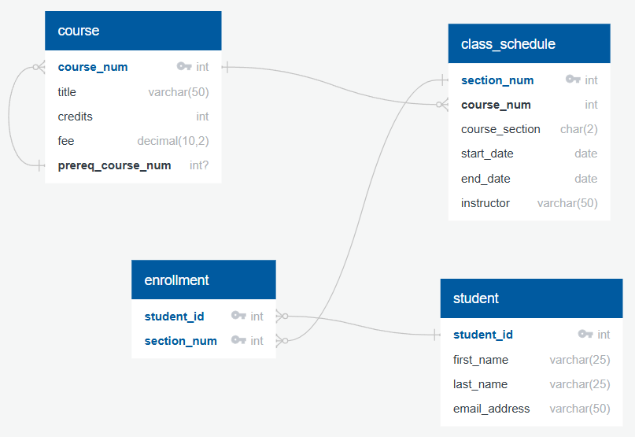

# Create a MySQL Database and ERD

## Overview
In this demo, we will modify the small university database from the [Implement ERD Demo](02_implement_erd.md) for MySQL and demonstrate how to reverse engineer a Crow's Foot notation ERD. We will be using MySQL Workbench 8.0. Click [here](https://dev.mysql.com/downloads/workbench/) to go to the MySQL Community Downloads page and follow the instructions to download and install for your operating system. You can also check out this [Installation Guide](https://www.geeksforgeeks.org/installation-guide/how-to-install-sql-workbench-for-mysql-on-windows/) with a step-by-step tutorial that is specific to Windows.

Finally, we will explore another ERD drawing tool, [QuickDBD](https://app.quickdatabasediagrams.com/). QuickDBD lets you create database diagrams by typing in its own simple, proprietary language. Once your ERD is complete, you can use the Export feature to generate the SQL code needed to build your database. Typically you would want to always pick an app that also offers export functionality to automatically generate your `CREATE TABLE` statements.

If you prefer the look of QuickDBD diagrams, you can also Import an existing database to automatically convert it into a QuickDBD diagram. The Import feature is limited to MySQL/MariaDB, Oracle, and SQL Server. Click [here](https://youtu.be/dR5lPbGLY84?si=Cc-yp9RMyE2KShfd) to watch a video on an Overview of QuickDBD.

## Introduction to MySQL
MySQL is an open-source relational database management system (RDBMS) developed by a Swedish company, MySQL AB, founded in 1995. Designed to be fast, reliable, and easy to use, MySQL quickly gained popularity as a database for web applications, especially those using the LAMP stack (Linux, Apache, MySQL, PHP/Python/Perl). In 2008, MySQL AB was acquired by Sun Microsystems, which was itself acquired by Oracle Corporation in 2010. Despite concerns about its future under Oracle’s ownership, MySQL has remained a widely used RDBMS, especially for open-source projects and small to medium-sized applications. It supports standard SQL features such as transactions, joins, and stored procedures, and has evolved to include support for advanced features like replication, clustering, and JSON data types.

In this demo, we will update the `university` tables to use more memory-efficient data types for the text columns based on the following requirements:

* Course titles should allow up to 50 characters.
* Course credits should only allow from 1 to 3.
* Course sections should store exactly 2 characters.
* Instructor should allow up to 50 characters.
* Student first and last names should allow up to 25 characters each.
* Student email addresses should allow up to 50 characters.

## Option 1 - Create Database and Reverse Engineer ERD

### Create a new Database
Open MySQL Workbench and on the Home screen, click the Local Instance MySQL connection (you may be prompted for your root password). Once connected, complete the following steps:

1. Go to the Navigator panel on the left and click the Schemas tab. 
2. Right/secondary click in the Schemas area and select Create Schema.
3. Enter `university` for your schema, then click Apply.
4. Review the generated SQL statement and click Apply again to finalize.
5. Click Finish to complete schema creation.


#### Create the `course` table
Click on the +SQL icon to create a new SQL tab for executing queries. The first step is we need to tell the SQL file that we want to use the `university` schema. Add the following code to the top of your file:

``` sql
USE university;
```

Now, click on the Lightning bolt icon to "Execute the selected portion or everything" button.


The `course` table will be modified to change the `title` column to use the `varchar(50)` data type. Additionally, a `CHECK` constraint will be added to ensure that the `credits` value is between 1 and 3. Copy the SQL code below and paste into the new query file.

``` sql
CREATE TABLE course (
  course_num int NOT NULL,
  title varchar(50) NOT NULL,
  credits int NOT NULL CHECK (credits >= 1 and credits <= 3),
  fee decimal(10,2) NOT NULL,
  prereq_course_num int NULL,
  CONSTRAINT course_pk PRIMARY KEY(course_num),
  CONSTRAINT prereq_course_fk FOREIGN KEY (prereq_course_num) REFERENCES course(course_num)
);
```
Click on the execute button to run the code and create the new table.

What happens if you try to execute the code again?

!!! warning

    You will get an Execution error because the table already exists. We will discuss ways to avoid this later in this demo.

#### Create the `class_schedule` table
The `class_schedule` table will be modified so that the `course_section` column stores exactly two characters, and the `instructor` column uses the `varchar(50)` data type. Copy/write the SQL code below and paste below the `CREATE TABLE course` code in the same query file.

``` sql
CREATE TABLE class_schedule (
  section_num int NOT NULL, 
  course_num int NOT NULL, 
  course_section char(2) NOT NULL, 
  start_date date NOT NULL, 
  end_date date NOT NULL, 
  instructor varchar(50) NOT NULL, 
  CONSTRAINT class_schedule_pk PRIMARY KEY(section_num), 
  CONSTRAINT class_schedule_course_fk FOREIGN KEY (course_num) REFERENCES course(course_num)
);
```
Select **only** the code to create the `class_schedule` table and execute the code to create the new table.

!!! tip 

    When you insert a 1-character string into a `CHAR(2)` column, the database **automatically pads** the value with a **space character** to reach the defined length.

#### Create the `student` table
The `student` table will be modified to set both the `first_name` and `last_name` columns to use the `varchar(25)` data type, and the `email_address` column to use `varchar(50)`. Copy/write the SQL code below and paste below the `CREATE TABLE class_schedule` code in the same query file.

``` sql
CREATE TABLE student (
  student_id int NOT NULL, 
  first_name varchar(25) NOT NULL, 
  last_name varchar(25) NOT NULL, 
  email_address varchar(50) NOT NULL, 
  CONSTRAINT student_pk PRIMARY KEY(student_id)
);
```
Select **only** the code to create the `student` table and execute the code to create the new table.

#### Create the `enrollment` table
The `enrollment` table will remain unchanged, as it is the bridge table and only contains `int` columns with `FOREIGN KEY` constraints referencing  the `student` and `class_schedule` tables. Copy/write the SQL code below and paste below the `CREATE TABLE student` code in the same query file.

``` sql
CREATE TABLE enrollment (
  student_id int NOT NULL, 
  section_num int NOT NULL, 
  CONSTRAINT enrollment_pk PRIMARY KEY (student_id, section_num), 
  CONSTRAINT enrollment_student_fk FOREIGN KEY (student_id) REFERENCES student(student_id), 
  CONSTRAINT enrollment_course_fk FOREIGN KEY (section_num) REFERENCES class_schedule(section_num)
);
```
Select only the code to create the `enrollment` table and execute the code to create the new table. We saw earlier that we cannot create a table if it already exists so we cannot run the entire query without getting an execution error. Let's address that now by adding some `DROP TABLE` statements.

#### Add Drop Table Statements
One option is to include a `DROP TABLE IF EXISTS` statement right above each CREATE TABLE statement.

!!! warning

    You will get an Execution error because you cannot drop the `course` table since the `class_schedule` table references it in the `FOREIGN KEY` constraint.

 The way to solve for this is to include `DROP TABLE IF EXISTS` statements at the top but order them in a way that it drops tables with `FOREIGN KEY` constraints first. Copy/write the SQL code below and paste at the top of the script.

``` sql
DROP TABLE IF EXISTS enrollment;
DROP TABLE IF EXISTS class_schedule;
DROP TABLE IF EXISTS course;
DROP TABLE IF EXISTS student;
```
These statements will drop all of the tables if they already exist.

!!! tip

    The `CASCADE` parameter in the `DROP TABLE` statement will automatically drop objects that depend on the table but this is another example of SQL functionality that only exists in some relational database systems. MySQL and SQLite do not support this parameter.

### Create ERD
Now that the database has been created with all tables and constraints, we can reverse engineer an ERD from the existing schema. From the top menu in MySQL Workbench, select **Database → Reverse Engineer...**. The first time you load the Reverse Engineer Database wizard, you will need to select your Local instance connection from the Stored Connection drop-down menu. Then, click **Next** twice to reach the page where you select the schema. Check the box for the `university` schema, then click **Next** two more times. Ensure that all objects are selected, and click **Execute** to run the reverse engineering process. Once it completes, click **Next**, then **Finish**. A new tab will open displaying the EER Diagram (ERD) for your database.

!!! note

    After the ERD Diagram is generated, MySQL Workbench may place the tables in random or overlapping positions. You will need to **manually arrange the tables and relationships** on the canvas to make the diagram easier to read and understand. Use the selection and move tools to organize the layout logically by grouping related entities together.

Here is our initial ERD in MySQL Workbench with only the table objects rearranged.



In MySQL Workbench, the **optionality** of a relationship line is determined by the database schema and whether the `REFERENCES` column allows `NULL` values. However, when building an ERD, we want to represent the **business rules**, not just the schema, since this helps analysts understand the data model and write better queries. Fortunately, MySQL Workbench lets you adjust optionality by editing the relationship and unchecking the *Mandatory* option on either side of a `FOREIGN KEY`.

!!! note
    Recall the inside symbol represents the minimum number of times an entity can be related to the other entity.

For our ERD, we will revise the relationships as follows:

1. **course-course**: Not every course has a prerequisite and not all courses are prerequisites, so Mandatory should be unchecked on the **Referencing** and **Referenced** Table side of the relationship.
2. **course-class_schedule**: Not every course is offered on the schedule, so Mandatory should only be unchecked on the **Referencing** side of the relationship.
3. **class_schedule/student–enrollment**: A class section would not have any enrolled students at the time it is added to the schedule and not every student enrolls in a class. Mandatory should be unchecked on **Referencing** side of both relationships with enrollment.

!!! note

    Identifying relationships in MySQL Workbench are notated with a solid dashed line. Since the bridge `enrollment` table cannot exist without both parent rows, it is an identifying relationship.

We now have our final ERD in MySQL Workbench.



## Option 2 - Create an ERD with Export SQL Option

### Create new diagram

Go to [QuickDBD](https://app.quickdatabasediagrams.com/). Click on **File → Load Sample Diagram** to load the sample to get a general idea of the QuickDBD syntax. You can also copy and paste the code to a text file or notebook for easy reference later.

!!! tip

    Creating an account with QuickDBD will allow you to save your diagram as well as share and collaborate with others. A **Pro Account** is required to save more than one diagram but you can always save the diagram code to your computer and paste into a blank diagram as needed.

##### Relationship Symbols

In QuickDBD, below are all of the symbols for the allowed relationships. You can learn about the allowed relationship types under **Docs → Relationships**.

```
-     - one TO one  
-<    - one TO many  
>-    - many TO one  
>-<   - many TO many  
-0    - one TO zero or one  
0-    - zero or one TO one  
0-0   - zero or one TO zero or one  
-0<   - one TO zero or many  
>0-   - zero or many TO one  
```

!!! note
    QuickDBD only has one option `0-0` that allows for zero optionality on both sides. If you use QuickDBD for your ERD, you will have to use the most appropriate available option.

#### Create the `course` entity

Copy/write the code below and paste into the blank file.

```
course
-
course_num PK int
title varchar(50)
credits int
fee decimal(10,2)
prereq_course_num int NULL FK -0< course.course_num
```
We now have a `course` entity on the diagram.



!!! warning

    QuickDBD considers all table fields as `NOT NULL` by default and explicitly defining it as such will result in a parser error.

The self-referencing relationship for `course` is an example where QuickDBD does not have the correct relationship option for zero or one to zero or many. We will use `-0<` since it best reflects the relationship that a course can only have one prerequisite in the current database design.

!!! note
    For the one TO zero or many or zero or many TO one options, make sure to choose the relationship that has the many cardinality on the correct side of the relationship.

#### Create the `class_schedule` entity

The relationship between `course` and `class_schedule` is 1:N. A course must exist to be on the schedule but not all courses will be offered on the the schedule. Therefore, we will use zero or many TO one. Copy/write the code below and paste below the `course` code in the same blank file.

```
class_schedule
-
section_num PK int
course_num int FK >0- course.course_num
course_section char(2)
start_date date
end_date date
instructor varchar(50)
```

We now have a `class_schedule` entity on the diagram.



!!! note
    You will need to rearrange the entities as desired as they get added to the diagram.

#### Create the `student` entity

Copy/write the code below and paste below the `class_schedule` code in the same blank file.

```
student
-
student_id PK int
first_name varchar(25)
last_name varchar(25)
email_address varchar(50)
```
We now have a `student` entity on the diagram.



#### Create the `enrollment` entity

The relationship between `class_schedule` and `enrollment` as well as `student` and `enrollment` are 1:N. A class section can be created without having any students enrolled and a student can exist without enrolling in any classes. Therefore, we will use zero or many TO one. Copy/write the code below and paste below the `student` code in the same blank file.

```
enrollment
-
student_id PK int FK >0- student.student_id
section_num PK int FK >0- class_schedule.section_num
```
We now have a `enrollment` entity on the diagram.



### Export to SQL file

We are now ready to export the diagram to a SQL file with the `CREATE TABLE` statements. Click on EXPORT and choose MySQL/MariaDB.

!!! note

    QuickDBD does not include `DROP TABLE IF EXISTS` statements and also uses the `ALTER TABLE` statement to add the `FOREIGN KEY` constraints after creating the tables. In addition, QuickDBD does not have syntax to add any `CHECK` constraints so make sure to add those to any relevant columns after downloading the SQL file.

## Conclusion

In this demo, we reviewed how to create a database and ERD by writing CREATE TABLE SQL statements manually and then reverse engineering the ERD in MySQL Workbench as well as used an ERD diagramming tool with export to SQL functionality to generate the necessary SQL statements.


