# CRUD Operations


## Overview

In HW4, you will be working with an interesting movie dataset made available by [GroupLens](https://grouplens.org/) which has been collected from the [MovieLens](https://movielens.org/) website. In this demo though, we will work with a smaller movie dataset from [IMDb.com](https://www.imdb.com/) to perform some simple query operations, as well as add, modify, and remove data from the database. Click [here](https://drive.google.com/file/d/1tNJSIrjKnzgzWEU2y8Heoly5YYZQCE4t/view?usp=sharing) to download the database file.

!!! tip
    We will be executing DML statements to modify data in the database. Recommend you keep one copy of the original database in a different location on your computer so you can recover if needed. Alternatively, you can use the Revert Changes button in DB Browser to undo any unintended modifications.

## Getting Started

Open the file with DB Browser and click on "Browse Data" to explore the data:


You should see the following five tables:

| Table        | Description                                   | Rows       |
|:-------------|:----------------------------------------------|:-----------|
| `title`      | Movies, Shorts, TV series, Video games, etc.  | 482,705    |
| `rating`     | IMDb ratings (voted by users) for some titles | 105,185    |
| `aka`        | "also known as" – in other regions/languages  | 777,155    |
| `castcrew`   | People/characters that are in which titles    | 2,770,776  |
| `person`     | Actors, Composers, Producers, Writers, etc.   | 1,382,189  |

Another way to check the number of rows in a table is by using the `COUNT()` function combined with the `*` special symbol.

``` sql
SELECT COUNT(*) from title
```

This returns the number of rows in the `title` table. We will learn about aggregation functions in the Intermediate SQL lecture but sharing this here since we will use it to validate the counts in every table in the database after you have performed some DDL operations. Don't worry though, that query will be provided in the `submission.yaml` file.

### How is the data organized?

Below is the ERD for the IMDb database created on [QuickDBD](https://app.quickdatabasediagrams.com/).

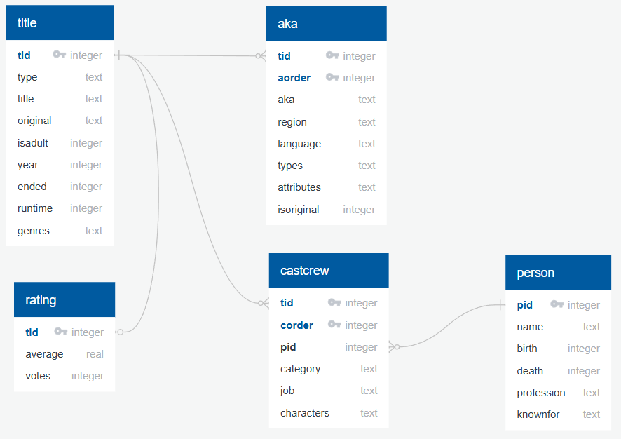

!!! note "Acknowledgment"
    The original version of this data came from [IMDb Non-Commercial Datasets](https://developer.imdb.com/non-commercial-datasets/).

## Let's Write Some SQL

Click on the "Execute SQL" tab in DB Browser.

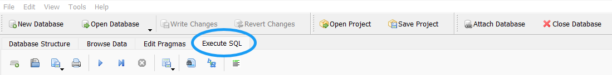

### Find a person

Tom Cruise recently brought some movie magic to the [2024 Paris Olympics closing ceremony](https://www.yahoo.com/entertainment/tom-cruises-olympics-closing-ceremony-stunt-took-over-1-year-to-plan-heres-how-it-came-together-160838336.html). Let's search for Tom in the `person` table.

``` sql
SELECT *
FROM person
WHERE name = 'Tom Cruise'
```
Here is the output:

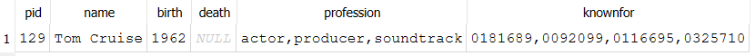

He still pulls off all of those stunts at age 62!

!!! note
    As we learned in the SQL Basics lecture, there are different SQL formatting styles. In this demo, we will focus on concepts and less about style such as indentation.

### Find all movies for a person

We now know that Tom's `pid` in the database is `129` so let's search the `castcrew` table to see how many movies Tom has in the database.

``` sql
SELECT *
FROM castcrew
WHERE pid = 129
```
Here is the output:

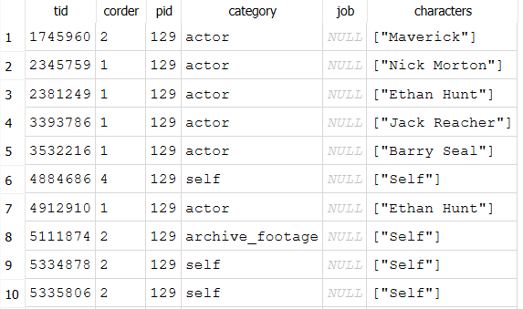

OK, Tom has appeared in 54 titles in the database. Let's narrow that down to just movies that he was an actor in the cast.

``` sql
SELECT *
FROM castcrew
WHERE pid = 129
and category = 'actor'
```
Here is the output:

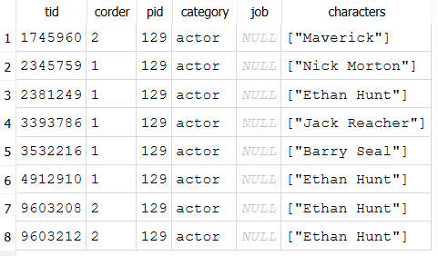

### Find a movie

Let's check out movie `tid` "9603212" in the `title` table.

``` sql
SELECT *
FROM title
WHERE tid = 9603212
```
Here is the output:

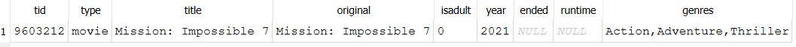

Wait, if you go to the [Mission: Impossible - Dead Reckoning Part One](https://www.imdb.com/title/tt9603212) page, Mission Impossible 7 came out in 2023? 


!!! note
    We have not covered SQL JOINS yet so in this demo every query will be a simple SQL statement with only one table.

### Update a movie

Let's update the database and set the year to **2023** and the runtime to **163** for 2h 43m.

``` sql
UPDATE title
SET year = 2023, runtime = 163
WHERE tid = 9603212
```
Here is the execution summary:

``` 
Execution finished without errors.
Result: query executed successfully. Took 0ms, 1 rows affected
At line 23:
UPDATE title
SET year = 2023, runtime = 163
WHERE tid = 9603212
```
!!! note
    DDL operations will not have any tabular output like DQL operations but you can confirm if the operation ran successfully and how many rows were affected in the section below the grid output.

#### Question 1

Copy and paste the code for the `UPDATE` statement above the provided `SELECT` statement into the `submission.yaml` file for Question 1.

### Insert a rating

Since Mission Impossible 7 had not come out yet when it was added to the database, let's also add the average rating and votes.

``` sql
INSERT INTO rating (tid, average, votes)
VALUES (9603212, 7.6, 311000)
```
Here is the execution summary:

```
Execution finished without errors.
Result: query executed successfully. Took 3ms, 1 rows affected
At line 28:
INSERT INTO rating (tid, average, votes)
VALUES (9603212, 7.6, 311000)
```

#### Question 2

Copy and paste the code for the `INSERT INTO` statement above the `SELECT` statement into the `submission.yaml` file for Question 2.

### Find movies using a logical operator

Let's search for all movies that start with `Mission: Impossible`.

``` sql
SELECT *
FROM title
WHERE title like 'Mission: Impossible%'
```
Notice the wildcard character `%` usage at the end of the line but not the beginning? This makes sure the query only returns movies that start with Mission: Impossible.

Here is the output:

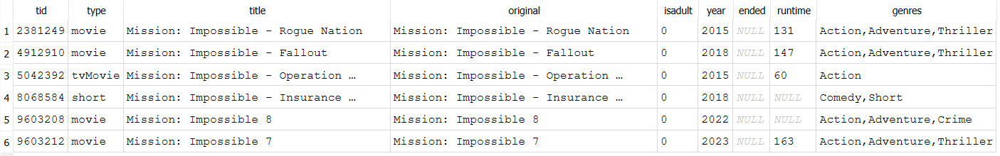

!!! tip
    You can combine the `NOT` operator with the `LIKE` operator to find all movies that do NOT start with Mission: Impossible.

OK, so all of the Mission Impossible movies reflect the release title but it looks like our database was created when Mission Impossible 7 and 8 had only been announced but no official titles yet. Let's also update the title from "Mission: Impossible 7" to "Mission: Impossible - Dead Reckoning Part One". I'm not aware of title change other than the "7" placeholder so we will go ahead and update the `original` title as well.

``` sql
UPDATE title
SET title = 'Mission: Impossible - Dead Reckoning Part One',
original = 'Mission: Impossible - Dead Reckoning Part One'
WHERE tid = 9603212
```
Here is the execution summary:

``` 
Execution finished without errors.
Result: query executed successfully. Took 0ms, 1 rows affected
At line 42:
UPDATE title
SET title = 'Mission: Impossible - Dead Reckoning Part One',
original = 'Mission: Impossible - Dead Reckoning Part One'
WHERE tid = 9603212
```
#### Question 3

Copy and paste the code for the `UPDATE` statement above the the `SELECT` statement into the `submission.yaml` file for Question 3.

### Delete a movie

[Mission: Impossible 8](https://www.imdb.com/title/tt9603208) came out in 2025 but I bet they wish they stuck to the original plan and just had them be the same two-part movie. Let's delete that movie from the `title` table.

``` sql
DELETE FROM title WHERE tid = 9603208
```
Here is the execution summary:

``` 
Execution finished with errors.
Result: FOREIGN KEY constraint failed
At line 48:
DELETE FROM title WHERE tid = 9603208
```

Recall from the ERD, the `title` table has mandatory one-to-many participation with the `aka` and `castcrew` tables and one-to-one with the `rating` table? We cannot delete the movie from `title` due to the `FOREIGN KEY` constraints referencing the `title` table.

??? question "What would we need to do to be able to delete the movie from the database?"
    We would have to first delete the `tid` from `aka`, `rating`, and `castcrew` then from `title`.

Another way to validate if your SQLite database has the Foreign Keys pragma turned on is to go to the Edit Pragmas menu and check if the Foreign Keys box is checked.

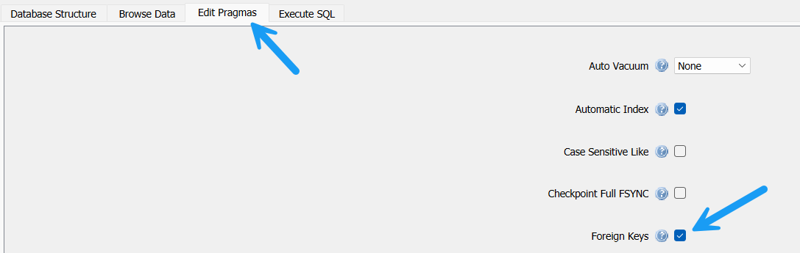

For this demo, we will just update the `title` table for the final conclusion of Mission Impossible and then select only the Mission Impossible movies with Reckoning anywhere in the title and order by `year` in `ASC` order.

``` sql
UPDATE title
SET title = 'Mission: Impossible - The Final Reckoning',
original = 'Mission: Impossible - The Final Reckoning',
year = 2025,
runtime = 169
WHERE tid = 9603208;

SELECT *
FROM title
WHERE title like 'Mission: Impossible%'
AND title like '%Reckoning%'
ORDER BY year
```

Here is the output:

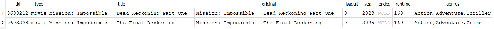

#### Question 4

Copy and paste the code for the `UPDATE` and `SELECT` statement to confirm all updates for the Mission Impossible Reckoning movies into the `submission.yaml` file for Question 4.

Let's wrap up this demo to show how you will frequently use the `ORDER BY` and `LIMIT` clauses for homework questions as well as a variety of common operators.

### Identify movie with top votes

Many questions in class participation and homework assignments will ask that you order the output either in ascending or descending order then limit the results. Let's practice that now and order all rows in the `rating` table by `votes` in `DESC` order and then combine with `LIMIT` clause to return the top movie.

``` sql
SELECT *
FROM rating
ORDER BY votes DESC
LIMIT 1
```
Here is the output:

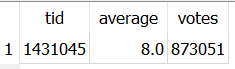

#### Question 5

Copy and paste the code for the `SELECT` statement into the `submission.yaml` file for Question 5.

## Let's Practice Common Operators

That concludes the part of the demo where the SQL will be provided for the class participation assignment. Next, we will work through some practice exercises that will require usage of the different operators discussed in the lecture.

### Multiple logical and comparison operators

Find all `tvSeries` titles that are either a `Comedy` genre with a `runtime` less than or equal to 30 minutes **OR** a `Thriller` genre with a `runtime` greater than 30 minutes that ended in `2019`. Order by the series run in years in descending order and show the top 5.

``` sql
SELECT
  *,
  ended-year as series_run
FROM title
WHERE 
  type = 'tvSeries'
  AND ((genres LIKE '%Comedy%' AND runtime <= 30)
	  OR (genres LIKE '%Thriller%' AND runtime > 30))
  AND ended = 2019
ORDER BY
  series_run DESC
LIMIT 5;
```

We have a variety of things going on with this query. Because each side of the `OR` has its own set of `AND` conditions, we need to group those `AND` conditions inside parentheses as well as wrap both in parentheses for the `OR` operator. This ensures that SQL evaluates each side of the `OR` independently, instead of mixing the logic together. We are also using a comparison operator for the runtime and a math operator to calculate the series run.

Here is the output:

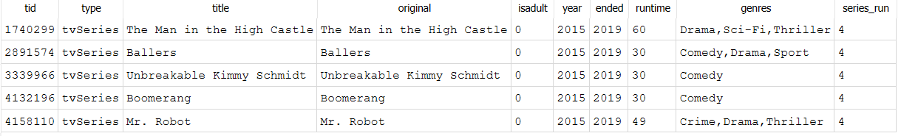

??? question "Does the order of the WHERE clause conditions matter?"
    If written correctly, No. However, if you leave out the outer parentheses for the OR conditions and change the order of the `type` and `ended` conditions, you can get unintended results.

### Math operators

Find the oldest actors/actresses that died in 2020. Order by their age at the time of their death in descending order and show the top 5.

``` sql
SELECT
  *,
  death - birth AS age
FROM person p 
WHERE 
  death = 2020
  AND (profession like '%actor%'
  OR profession like '%actress%')
ORDER BY
  age DESC
LIMIT 5;
```

Here is the output:

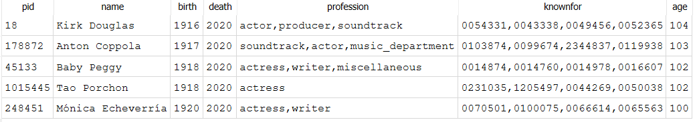

## Your Turn!

Based on what we have learned so far, it is now your turn to practice and work on several questions on your own or in a small group in class.

### Question 6

Identify the movie title that is scheduled for the latest future release. Select only the `tid`, `title`, and `year` in that order.

Copy and paste your code into the `submission.yaml` for Question 6.

### Question 7

Delete the `tid` identified in Question 6 from the entire database including any `person` that does **NOT** appear in the `castcrew` for any other movie.

!!! hint
    You do **NOT** have to write a complex query to identify the **ONE** person that should be deleted although you are welcome to ask for AI assistance. You can identify the `pid` by writing a series of `SELECT` statements for all persons that are scheduled to be in the `castcrew` for the movie.

Copy and paste ALL of your code into the `submission.yaml` for Question 7 above the count validation query shown below that is included in the `submission.yaml` file.

``` sql
SELECT 
(SELECT COUNT(*) from title) as title_cnt,
(SELECT COUNT(*) from rating) as rating_cnt,
(SELECT COUNT(*) from aka) as aka_cnt,
(SELECT COUNT(*) from castcrew) as castcrew_cnt,
(SELECT COUNT(*) from person) as person_cnt
```
### Question 8

Identify the top 5 oldest persons that were still alive as of **2020** that were born in the 20th century whose profession was either a director or assistant director but never acted (actor or actress) in any movie. Select only the `pid`, `name`, `birth`, `death`, `profession` and derived `age` in that order. Order by their `age` in descending order.

!!! hint
    You should only consider information in this database and not whether the person is no longer alive now. The database was last updated in 2020.

### Question 9

Identify **ALL** moves that have `votes` greater than 100,000 and an `average` rating greater than 9.0 OR `votes` greater than 500,000 and an `average` rating greater than 8.5. Select only the `tid`, `average`, and `votes`. Order by their `average` in descending order.

Copy and paste your code into the `submission.yaml` for Question 9.

### Question 10

Identify the top 10 persons with the longest history in the IMDb database that were between 80 and 90 years old as of 2020 (dead or alive) whose profession was actor or actress but they never provided soundtrack services for a movie. Select only the `pid`, `name`, `birth`, `death`, `profession` and derived `age` in that order.

!!! hint
    The `pid` is an artificial key that is assigned in ascending order when the person is first added to IMDb.

## Conclusion

In this demo, we used DB Browser for SQLite to write some basic SQL queries and explored a movie dataset from [IMDb.com](https://www.imdb.com/).
