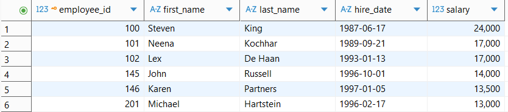
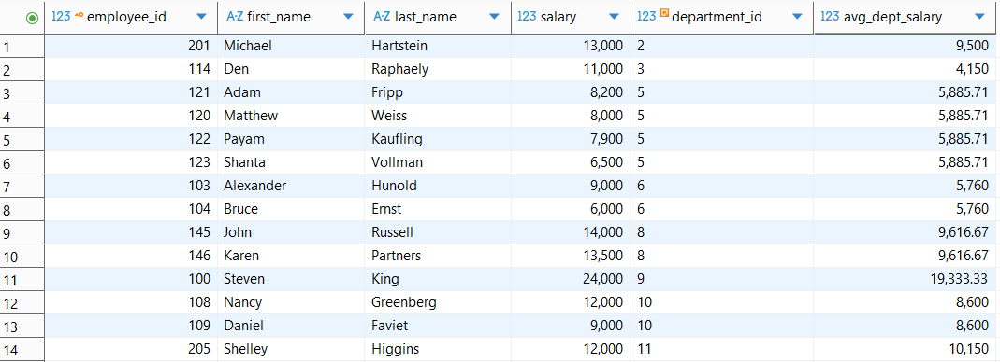
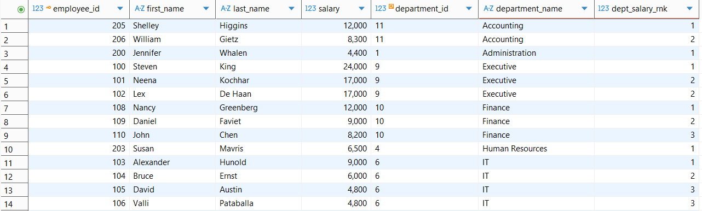
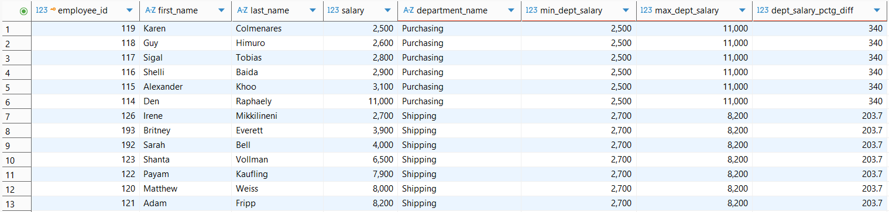

# Subqueries, CTEs, and Window Functions

## Overview
In this demo, we will be using [DBeaver Community Edition](https://dbeaver.io/download/) to write some queries using the employee_small.db to demonstrate how to use subqueries, CTEs, and window functions to tackle some interesting questions. We will also demonstrate how to use the `Explain Execution Plan` in DBeaver as well as the `EXPLAIN` and `EXPLAIN ANALYZE` SQL keywords for SQLite, MySQL, and PostgreSQL. Click [here](https://drive.google.com/file/d/1g1lfZEIL9hyTLIR143DdRzcMJY2DwSQM/view?usp=sharing) to download the starter `.sql` file for this demo.

### Question 1

Write a query that returns all employees that make more than 50% of the highest paid employee in the company. Order by salary in descending order and then by hire date in ascending order.

Here is the output:

### Question 2

Write a query that returns all employees whose salary is higher than the average salary of all employees in their department. Order the results by department_id in ascending order and salary in descending order.

We will tackle this question 4 different ways:

1. Subquery with a JOIN
2. Correlated subquery
3. CTE with a JOIN
4. Aggregate and window function
   
The preferred option should be based on query performance and column requirements for the output.

!!! tip "Pin Tabs"
    Demonstrate how to pin output tabs in DBeaver!

Here is the output:

### Question 3

Write a query that returns the top 3 employees based on salary in each department. Assign ranks sequentially with no gaps in the case of ties. Order by department name in ascending order and then salary in descending order.

Here is the **sample** output:

!!! tip "Ranking Function Differences"
    Demonstrate the difference in output for the three ranking window functions!

### Question 4

Write a query that returns all employees that work in a department that has a 200% difference between the min and max salary in the department. Return the min and max department salary as well as the department salary % difference. Round the percentage to 2 decimal places and express as a percentage but without the % sign.

*We will tackle this question using chained CTEs.*

!!! tip "Analytic Function Differences"
    Demonstrate the difference in output for `FIRST_VALUE()` and `LAST_VALUE()` window functions!

Here is the output:

Let's wrap this up and demonstrate all 4 of the query options for Question 2 in PostgreSQL and compare the EXPLAIN output.

## Conclusion

In this demo, we used DBeaver to write some advanced SQL queries.