# Transform and Load Data

## Overview

In this lab, you will be using SQL to transform raw Spotify music data containing information about an album, artist(s), tracks, and genre(s) all in a single table into a relational database. In practice, there are ETL (Extract, Transform, and Load) tools to handle similar tasks but we will be leveraging our new SQL skills to handle the job.

Click [here]({{ content_links().CP5_Transform_Load_Data }}) to download all resources needed for the lab. Here is a summary of the contents in the `music_resources.zip` file:

1. `music.db` database with all tables created. The `stage_music_data` table has been pre-loaded with 375,141 rows of data.
2. The `transform_load_music_data_student.sql` file is where you will be writing all of your SQL code to transform and load the data into the database tables.
3. The `submission.yaml` file for all of the questions below.

Here is an ERD for the `music` database:

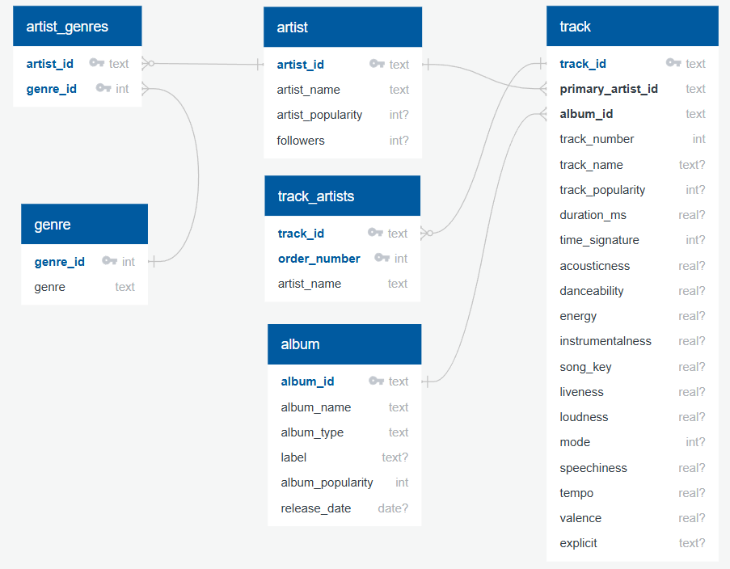

!!! note "Acknowledgment"
    The original version of this data came from the [Spotify Web API](https://developer.spotify.com/documentation/web-api) but the raw data used to load into the stage table came courtesy of this [Kaggle dataset](https://www.kaggle.com/datasets/tonygordonjr/spotify-dataset-2023).

## Getting Started

Open the `music.db` file with DB Browser and click on the Database Structure tab to see all 7 tables in the database.

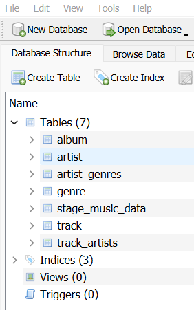

Click on the Browse Data tab and then select the `stage_music_data` table from the drop-down and review the general structure of the table and values so you have an idea of what you will be working with.

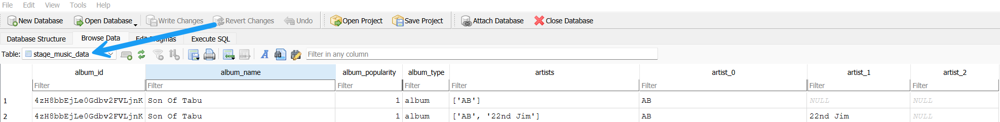

Click on the Execute SQL tab and then click on the yellow folder icon and then navigate to the folder that you saved the resource files and open the `transform_load_music_data_student.sql` file.

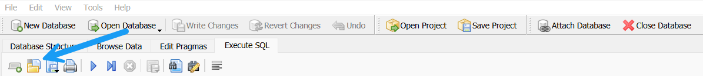

The SQL script is organized in two sections:

### Part 1: Drop and Create Tables

Do **NOT** make any changes in the Part 1: Drop and Create Tables section. You are likely to make mistakes as you are loading the database so you may need to recreate the tables to refresh the database. Upon completion of this lab, you should be able to run the entire SQL script file repeatedly to recreate and load the database tables.

!!! warning
    The Drop and Create Table statements should **NOT** be included in the the `submission.yaml` file.

### Part 2: Transform and Load Tables

This is where you will be writing all of your SQL for each task. Each task will also correspond to a respective question in the `submission.yaml` file for the autograder.

In `CP2_CRUD_Operations` and `HW3_CRUD_Operations`, you created new data by writing simple `INSERT INTO` statements 1 row at a time. In this lab, you will be loading the tables with `INSERT INTO` statements but instead of `VALUES()`, you will be using a `SELECT` statement. Here is a generic example:

``` sql
INSERT INTO table (column1, column2) 
SELECT
  source_data1 as column1,
  source_data2 as column2
FROM source_table;
```

## Task 1

Write a `SELECT` statement to `INSERT INTO` **artist** table from the **stage_music_data** table. Due to duplicates in the stage data for each track over time, we will use the MAX value for artist_popularity and followers for each artist. If you review the `stage_music_data` table, you will see there are `artist_n` columns for each of the artists on the track, an `artist_id` column as well as a `name` column. We only have the `artist_id` for the primary artist on the track so you will use the `artist_id` and `name` columns for this task.

After completing the `INSERT INTO` statement, run the following to validate the stats in the table:

``` sql
SELECT 
  ROUND(AVG(artist_popularity),2) AS artist_popularity_avg,
  ROUND(AVG(followers),2) AS followers_avg,
  COUNT(*) AS artist_cnt
FROM artist;
```

Here is the output:

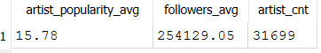

Run the following to check the column values for the top 10 artists based on followers:

``` sql
SELECT 
  artist_id,
  artist_name,
  artist_popularity,
  followers
FROM artist
ORDER BY
  followers DESC
LIMIT 10;
```

Here is the output:

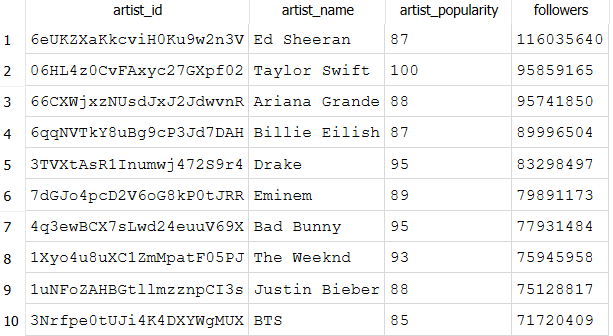

### Question 1

Copy and paste the code for the `INSERT INTO` statement above the `SELECT` statement into the `submission.yaml` file for Question 1.

!!! warning
    Be sure to have `;` in between all SQL statements in the `submission.yaml` file.


### Question 2

The `SELECT` statement to check the column values for the top 10 artists based on `followers` is provided in the `submission.yaml` file for Question 2.

## Task 2: Part a

Write multiple `SELECT` statements to `INSERT INTO` **genre** table from the **stage_music_data** table. Think about how you might approach combining the data into rows from 5 separate genre_n columns.

!!! info "IMPORTANT"
    The genre table leverages the SQLite built in rowid for the genre_id column. The first `INSERT INTO` statement has been included so you can see the example format for this task.

The `genre` table does not have a direct validation in the `submission.yaml` file. The genre counts will be validated in Task  

## Task 2: Part b

Write multiple `SELECT` statements to `INSERT INTO` artist_genres table from the `stage_music_data` table.

!!! tip "Tips"
    This is the first instance a `JOIN` will be needed since you will need genre_id from part a for each of the genre fields. Think about how you can join to `genre` to get the newly generated `genre_id` artificial key.

After completing the `INSERT INTO` statements, run the following to validate the counts in the tables:

``` sql
SELECT
  g.genre,
  COUNT(DISTINCT artist_id) AS artist_cnt,
  (SELECT COUNT(genre_id) FROM genre) AS genre_cnt
FROM artist_genres ag
INNER JOIN genre g ON ag.genre_id = g.genre_id
GROUP BY
  g.genre
ORDER BY
  COUNT(DISTINCT artist_id) DESC
LIMIT 10;
```

Here is the output:

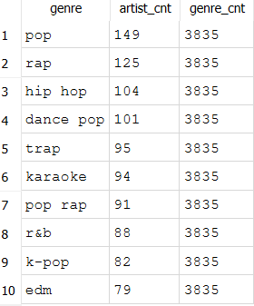

### Question 3

Copy and paste the code for ALL of the `INSERT INTO` statements from Part a and b above the `SELECT` statement into the `submission.yaml` file for Question 3.

## Task 3

Write a `SELECT` statement to `INSERT INTO` **album** table from the **stage_music_data** table.

!!! tip "Tips"
    This is a simple SELECT statement for the album specific fields. Do **NOT** do any conversions on the release_date in the `stage_music_data` table.

After completing the `INSERT INTO` statement, run the following to validate the stats in the table:

``` sql
SELECT 
  ROUND(AVG(album_popularity),2) AS album_popularity_avg,
  COUNT(DISTINCT album_type) AS album_type_cnt,
  COUNT(DISTINCT label) AS label_cnt,
  COUNT(*) AS album_cnt
FROM album;
```

Here is the output:

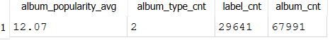

Run the following to check the column values for the top 10 artists based on followers:

``` sql
SELECT 
  album_id, 
  album_name, 
  album_type, 
  label, 
  album_popularity,
  release_date
FROM album
ORDER BY
  album_popularity DESC,
  release_date
LIMIT 10;
```

Here is the output:

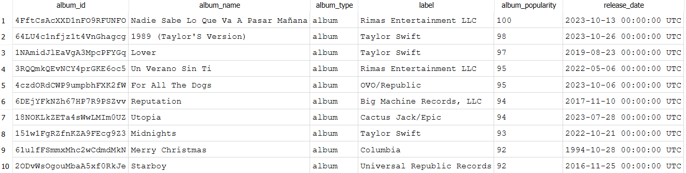

### Question 4

Copy and paste the code for the `INSERT INTO` statement above the `SELECT` statement into the `submission.yaml` file for Question 4.

### Question 5

The `SELECT` statement to check the column values for the top 10 albums based on `album_popularity` is provided in the `submission.yaml` file for Question 5.

## Task 4

Write a `SELECT` statement to `INSERT INTO` **track** table from the **stage_music_data** table.

!!! tip "Tips"
    This is also simple `SELECT` statement for the track specific fields but be careful with differences in column names in the `stage_music_data` table.

After completing the `INSERT INTO` statement, run the following to validate the stats in the table:

``` sql
SELECT
  COUNT(DISTINCT primary_artist_id) AS artist_cnt,
  COUNT(DISTINCT album_id) AS album_cnt,
  ROUND(AVG(track_popularity),2) AS track_popularity_avg,
  ROUND(AVG(acousticness),2) AS acousticness_avg,
  ROUND(AVG(danceability),2) AS danceability_avg,
  ROUND(AVG(energy),2) AS energy_avg,
  ROUND(AVG(instrumentalness),2) AS instrumentalness_avg,
  ROUND(AVG(song_key),2) AS song_key_avg,
  ROUND(AVG(liveness),2) AS liveness_avg,
  ROUND(AVG(loudness),2) AS loudness_avg,
  ROUND(AVG(mode),2) AS mode_avg,
  ROUND(AVG(speechiness),2) AS speechiness_avg,
  ROUND(AVG(tempo),2) AS tempo_avg,
  ROUND(AVG(valence),2) AS valence_avg,
  COUNT(*) AS track_cnt
FROM track;
```

Here is the output:

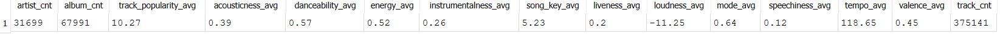

Run the following to check the column values for the top 10 tracks based on `track_popularity`:

``` sql
SELECT
  track_id, 
  primary_artist_id, 
  album_id, 
  track_number, 
  track_name, 
  track_popularity, 
  duration_ms, 
  time_signature, 
  acousticness, 
  danceability, 
  energy,
  instrumentalness, 
  song_key, 
  liveness, 
  loudness, 
  mode, 
  speechiness, 
  tempo, 
  valence, 
  explicit
FROM track
ORDER BY
  track_popularity DESC,
  track_id
LIMIT 10
```

Here is a sample output:

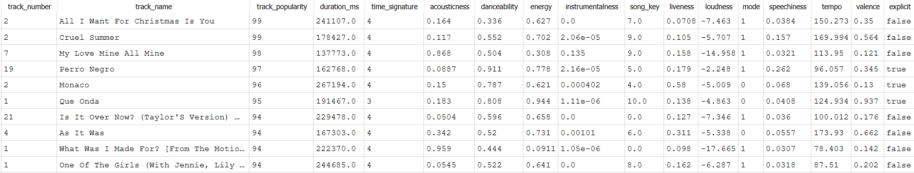

!!! note
    Not all columns are displayed in the sample output.

### Question 6

Copy and paste the code for the `INSERT INTO` statement above the `SELECT` statement into the `submission.yaml` file for Question 6.

### Question 7

The `SELECT` statement to check the column values for the top 10 tracks based on `track_popularity` is provided in the `submission.yaml` file for Question 7.

## Task 5

Write multiple `SELECT` statements to `INSERT INTO` **track_artists** table from the **stage_music_data** table. This task will be similar to how you approached loading the data for **artist_genres**.

!!! tip "Tips"
    `order_number` can be hard coded 1,2,3,4,5 for each artist_n (0,1,2,3,4) column. See comment above for the CREATE TABLE statement for `track_artists` regarding `artist_name` vs. `artist_id`.

After completing the `INSERT INTO` statements, run the following to validate the stats in the table:

``` sql
SELECT
  COUNT(DISTINCT order_number) AS order_number_cnt,
  COUNT(DISTINCT artist_name) AS artist_cnt,
  COUNT(*) AS track_artist_cnt
FROM track_artists;
```

Here is the output:

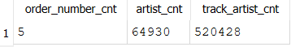

Run the following to check the column values for a sample track:

``` sql
SELECT
  *
FROM track_artists
WHERE track_id = '7CyPwkp0oE8Ro9Dd5CUDjW'
ORDER BY
   order_number;
```

Here is a sample output:

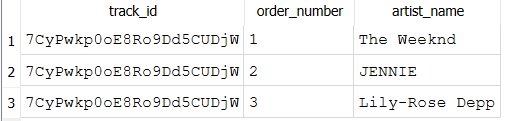

### Question 8

Copy and paste the code for the `INSERT INTO` statements above the `SELECT` statement into the `submission.yaml` file for Question 8.

### Question 9

The `SELECT` statement to check the column values for the sample track is provided in the `submission.yaml` file for Question 9.

### Part 3: Validate Data

We have been validating the data as we moved along but below is a summary of each table and the expected number of rows.

| Table           | Description                                                                         | Rows      |
|:----------------|:------------------------------------------------------------------------------------|:----------|
| `album`         | Album specific information such as name, label, popularity, and release date.       | 67,991    |
| `artist`        | Artist specific information such as name, popularity, and number of followers.      | 31,699    |
| `artist_genres` | All genres that an artist is associated with if any.                                | 18,455    |
| `genre`         | Genre names for all artists.                                                        | 3,835     |
| `track`         | Track information including name, popularity, duration, and all Spotify metrics.    | 375,141   |
| `track_artists` | All artists that are associated with a track.                                       | 520,428   |

### Part 4: Lab Submission

Submit the completed `submission.yaml` file on Canvas/Gradescope for `CP5_Transform_Load_Data`.

## Conclusion

In this demo, we used DB Browser for SQLite to write multiple SQL queries to transform raw Spotify music data into a relational database.